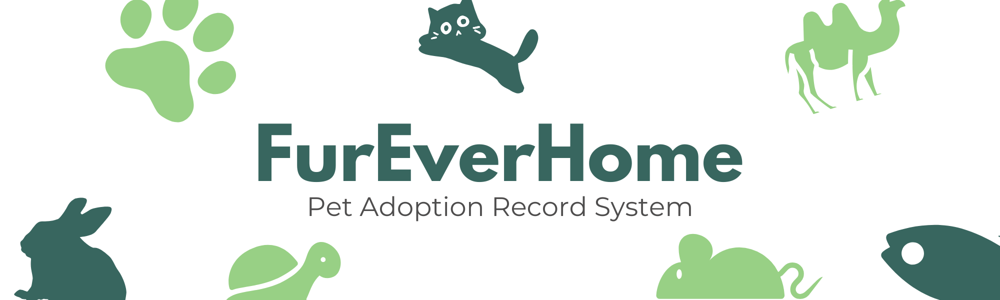

<html>
<head>
</head>
<body>
 

# FurEverHome: Pet Adoption Record System

## Description
**FurEverHome** is a data-driven command center for animal shelters. You manage the entire shelter lifecycle from a single, flat-design interface. This system replaces simple lists with analytics, clinical logs, and automated pipelines.

---

# Features 
- **Command Center Dashboard:** To track occupancy, adoption rates, and medical alerts through real-time metric cards.
- **Pet Profile 360:** To access medical history, behavioral analysis, and personality bios in one tabbed view.
- **Adoption Pipeline:** To move applications through five stages from new inquiry to finalized using a drag and drop Kanban board.
- **Medical Bay & Behavioral Logs:** To log vaccinations, surgeries, and social assessments with progress bars and score sliders.
- **Unified Inbox & Foster Network:** To chat with adopters and track the capacity of foster home through a dedicated management grid.
- **Notification Center:** To receive color-coded alerts for new applications or criticial medical tasks. 
---

## User Role
- **Admin** - Manages all pet record in the system.

---

## Tech Stack
- **Frontend:** - HTML, CSS
- **Backend** - PHP
- **Database** - MySQL

--- 

##  System Flow of FurEverHome: Pet Adoption Record System

### 1. Daily Overview
- The admin log in to the Command Center.
- Check the occupancy progress bar and medical alert cards.
- The activity feed tells the admin exactly what happened while they were away.

### 2. Communication and Inbox
- Open the Notification Center to see new messages. 
  - Select the Unified Inbox.
  - Use the two-column chat to respond to adopters or foster parents.
  - Identify contacts quickly by their colored tags such as Purple for Foster Parent

### 3. Add New Pets
- Click the + Add New Pet button. This opens the Add Pet Wizard.
  - Enter basic details.
  - Log medical status.
  - Upload photos.
  - The system validates your data and adds the pet to the All Pets grid.

### 4. Manage the Adoption Pipeline
- Drag an application card from the New Inquiry to Interviewing.
- Click Schedule Interview to Open the modal and select a time slot.
- Move Cards to Trial Period after home visits are successful.

  
### 5. Clinical and Behavioral Updates
- Select a pet to view their 360 Profile.
  - Medical Bay: Update vaccination records or log surgeries.
  - Behavioral Logs: Use sliders to rate trainability or energy levels.
  - These updates sync across the system for the team to stay informed. 

### 6. Foster Placement
- Navigate through Foster Network
  - Filter for Has Vacancy or Special Needs Experienced.
  - Review capacity meters to find an open home.
  - Click Assign Pet to move an animal into a foster home.
 
 <h2>Developers</h2>
 
  </body>
</html>
